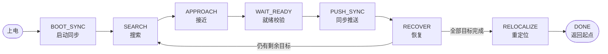

# 第二十一届全国智能汽车大赛蚂蚁搬家组
TU-Smart闪影队蚂蚁搬家代码开源，华东赛第一天冠军，第二天季军，国赛由于场地灯光原因，模型效果差，遗憾国二，但我们仍觉得方案还有非常多的可参考内容，也为往后智能车类似赛题上提供一些经验
## 目录

- [1. 系统概述](#1-系统概述)
- [2. 硬件平台](#2-硬件平台)
- [3. 仓库结构](#3-仓库结构)
- [4. 版本分支说明](#4-版本分支说明)
- [5. 单车软件架构](#5-单车软件架构)
- [6. 实时调度模型](#6-实时调度模型)
- [7. 双车协同机制](#7-双车协同机制)
- [8. 任务状态机](#8-任务状态机)
- [9. 坐标系与目标定义](#9-坐标系与目标定义)
- [10. 通信协议](#10-通信协议)
- [11. 配置系统](#11-配置系统)
- [12. 构建与烧录](#12-构建与烧录)
- [13. 调试手段](#13-调试手段)
- [14. 开发约定](#14-开发约定)

---

## 1. 系统概述

### 1.1 要解决的问题
本系统的核心思路是**用两台车形成 V 字夹持阵型**：主车从目标的一侧靠近，从车绕到另一侧，两车推杆在物体前方合围成 V 形，然后以同步的速度和航向共同推送。这样物体被两个方向的力约束，横向自由度被消除，可以稳定地被推出场地边界。

由此带来的真正难点不是"推"，而是**两台独立运行的车如何在没有中心节点的情况下达成一致**：
- 两车必须对"当前目标是哪一个、它在世界坐标的哪里、要推向哪条边"达成共识；
- 两车必须在时间上同步启动推送，否则先动的一方会把物体推歪；
- 任一方视觉丢失、无线丢包、被障碍打断时，双方要能一致地回退到安全状态而不是各推各的。

系统的绝大部分复杂度都花在这三件事上。

### 1.2 任务主流程



一轮完整搬运（`SEARCH → APPROACH → WAIT_READY → PUSH_SYNC → RECOVER`）会重复执行，直到 `config.py` 中配置的目标数量全部归零，才从 RECOVER 转入最终的重定位和返回流程。

上图只画了正常路径。实际运行中，视觉丢失、无线超时、避障触发等都会导致状态间回退与重入——例如 PUSH 丢目标会退回 APPROACH、WAIT_READY 判定挡路会触发路线重靠近、SEARCH 超时会直接跳到 RELOCALIZE。完整的异常出口见 [§8. 任务状态机](#8-任务状态机)。

### 1.3 三路定位融合

车辆位姿（X, Y, yaw）由三个来源共同维持，各自解决不同的问题：

| 来源 | 提供的量 | 特性 | 在系统中的角色 |
| --- | --- | --- | --- |
| 四轮编码器里程计 | 连续 X / Y | 高频、连续、无跳变，但随行驶距离累积误差 | 位置的**主来源** |
| IMU（IMU660RX） | 连续 yaw、Roll / Pitch | 高频、平滑，但陀螺积分存在零漂 | 航向的**主来源** |
| OpenART 黄线视觉 | 绝对 yaw、绝对 X 或 Y | 低频、离散、可能无效，但**无累积误差** | 特定阶段的**校准来源** |

关键设计：视觉**不做每帧覆盖**。`_vis_yaw_fix_en` 在正常运行中始终为 `False`，因为一次误识别的黄线就会让车辆航向瞬间跳变，进而毁掉整个推送阵型。视觉修正只在明确安全的时机按轴打开：

- **yaw**：只在主车 RECOVER 的 `YAW_FIX` 子状态中打开。此时车辆已停稳、正对着刚推出的那条边、航向理论值已知（0°/90°/180°/270° 之一），视觉误差超过 ±25° 直接判为无效帧丢弃。稳定后调用一次 `base.correct_yaw()`，把连续 yaw 的基准一次性对齐到精确正交角，之后 IMU 从新基准继续积分。
- **X / Y**：在 RECOVER 边线修正、SEARCH 黄线补坐标、PUSH_SYNC、RELOCALIZE 等阶段按单轴打开。打开时还会叠加 `_vis_pos_fix_edge_gate_cm` 边界门槛——只有落在预期场地边界附近的坐标才被采纳，防止把场地中央的误识别当成边线。

这套"里程计跑、视觉在关键点打桩"的策略，是在 MicroPython 算力下取得稳定性的关键折中。

---

## 2. 硬件平台

### 2.1 主控与外设（每车一套）

| 部件 | 型号 / 规格 | 说明 |
| --- | --- | --- |
| 主控 | 逐飞 Seekfree RT1021 MicroPython 核心板 | 跑任务状态机、运动控制、通信 |
| 底盘 | 四轮全向麦轮 | 可横移、可原地转，是 V 字夹持和绕行编队的前提 |
| 电机 | 4× 直流减速电机 + 编码器 | PWM 13 kHz，PWM/DIR 双线控制 |
| 编码器 | 4× 正交编码器，`capture_div=6` | 引脚 C0/C1、D15/D16、C2/C3、D13/D14 |
| IMU | IMU660RX | 六轴，10 ms 采样，提供 yaw / Roll / Pitch |
| 视觉 | OpenART 摄像头模块 | 独立运行 `openart.py`，需 SD 卡存放 YOLO 模型 |
| 显示 | 1.14 寸 LCD（SPI2，60 MHz） | 调试信息，500 ms 刷新 |
| 提示 | 蜂鸣器（B26） | 视觉修正提示 + 避障提示，两路独立 |
| 通信 | UART2（无线模块）、UART3（OpenART） | 均为 230400 baud |

### 2.2 电气接口速查

```
电机：M1 PWM_D4/DIR_D5(invert)   M2 PWM_C30/DIR_C31
      M3 PWM_D6/DIR_D7(invert)   M4 PWM_C28/DIR_C29
编码器：E1 C0/C1   E2 D15/D16(inv)   E3 C2/C3(inv)   E4 D13/D14(inv)
LCD：  CS=B29  RST=B31  DC=B5  BLK=C21  SPI2 @60MHz
串口：  UART2 = 双车无线   UART3 = OpenART 视觉
其他：  蜂鸣器 B26   LED C4   按键 KEY_HANDLER(10)   电压 ADC B27
```

以上定义集中在 [`base.py`](国赛终版高速新/base.py) 的 `hw_init()` 中，换板子时只需要改这一个函数。

### 2.3 两车的物理差异

主车和从车**不是完全相同的硬件**，两处差异必须在配置中体现：

1. **车身标识**：从车贴有黄色胶带（用于主车视觉识别对方），主车没有。这导致两车的 OpenART 需要不同的颜色阈值处理策略，由 `openart.py` 的 `CAR_ID` 区分（`1` = 主车，`2` = 从车）。
2. **摄像头安装与推杆几何**：两车的单应矩阵、车体屏幕原点、推杆偏移都不同。主车为屏幕原点 `(160, 239)`、`rod_offset_cm = 10.0`；从车为 `(155, 239)`、`7.0`。
3. **主车推杆两侧装有标记球**：左紫、右橙，供从车在 APPROACH / VDOCK 阶段做视觉相对定位，用来对齐 V 字阵型。从车没有标记球。
4. **里程计标定系数**：两车的 `_MILEAGE_KX / _MILEAGE_KY` 是分别实测的，换轮胎或底盘后必须重新标定。

---

## 3. 仓库结构

```
.
├── 国赛终版高速新/                   # 版本分支：高速调参，五类目标齐全
├── 国赛终版中速新写死网球三个版本/    # 版本分支：强制首个目标为网球
├── 国赛终版中速新熊和沙包/           # 版本分支：低速稳态，玩偶+沙包
├── 国赛终版中速新网球和沙包/         # 版本分支：中速，网球+沙包
├── 白平衡标定.py                     # OpenART 独立白平衡标定脚本
├── 第一天修改代码顺序.txt            # 赛前现场操作清单
└── README.md
```

### 3.1 每个版本目录的内部结构

四个版本目录内部结构完全一致：

```
国赛终版XXX/
├── main.py              # 板端入口（4 行，只调 base.main_init() + base.loop()）
├── base.py              # 3173 行  主从共用底层
├── task_leader.py       # 5812 行  主车任务状态机
├── task_follow.py       # 5560 行  从车任务状态机
├── config.py            #  102 行  构建期配置（身份、目标数量、开关）
├── debug_switch.py      #   23 行  调试开关
├── openart.py           # 2096 行  OpenART 视觉端（独立烧录，不参与 build.bat）
├── build.bat            # 构建脚本
├── leader/              # ← 构建产物，主车烧录此目录（勿手改）
│   ├── main.py
│   ├── base.mpy
│   ├── task.mpy         # 由 task_leader.py 编译而来
│   ├── config.mpy       # _IS_LEADER = 1
│   └── debug_switch.mpy
├── follower/            # ← 构建产物，从车烧录此目录（勿手改）
│   └── ...              # 同上，task.mpy 来自 task_follow.py，_IS_LEADER = 0
├── tools/mpy-cross-v1.20.0/   # 交叉编译器（Windows，armv7emdp）
├── 工程说明.md          # ★ 该版本的权威技术文档
├── 参数文档.md
├── 全流程状态机提速参数建议.md
├── 全流程状态机流程优化建议.md
├── 已移除代码备份.md    # 为省 RAM 删掉的代码原文，可按块粘回
└── *.txt                # 实车日志
```

### 3.2 源文件职责

| 文件 | 行数 | 职责 |
| --- | ---: | --- |
| `main.py` | 4 | 板端入口。刻意保持极简，所有初始化都在 `base` 内 |
| `base.py` | 3173 | **主从共用**。硬件初始化、IMU 姿态解算、里程计积分、四级 PID、麦轮解算、运动请求接口、三种串口协议收发、定时器调度、LCD、蜂鸣、全局异常保护 |
| `task_leader.py` | 5812 | **主车专用**。搜索轨迹规划与目标选择、接近路径规划、就绪判定与路线避障、推送决策与完成判定、恢复流程、最终重定位 |
| `task_follow.py` | 5560 | **从车专用**。编队跟随控制、V 字夹持（VDOCK）、标记球视觉定位、跟推控制、恢复找车、跟随式重定位 |
| `config.py` | 102 | 构建期注入的配置。身份、初始/终点位姿、目标计数规则、避障开关、SEARCH 参数 |
| `debug_switch.py` | 23 | 四个调试开关，全部用 `micropython.const` 定义以便编译期消除 |
| `openart.py` | 2096 | 视觉端。黄线定位、YOLO 检测、颜色细分类、标记球检测、α-β 跟踪、单应矩阵换算、上下位机协议 |

### 3.3 公共脚本

- **`白平衡标定.py`** — 独立烧到 OpenART 运行。把白纸贴推杆放在车前，脚本压低曝光到 2500 µs、裁出中心 60×60 ROI、开自动白平衡跑满 3 秒收敛，然后打印出固定 RGB 增益值。这个值必须复制回 `openart.py`，因为**所有颜色阈值都是在固定白平衡下标定的**，白平衡一变全部失效。
- **`第一天修改代码顺序.txt`** — 赛前现场操作清单，从白平衡 → 颜色阈值 → 烧录 → 逐项核对配置的完整顺序。

---

## 4. 版本分支说明

四个目录是**同一套架构的不同赛题配置分支**。它们的文件清单、状态机结构、通信协议、分层设计完全相同，差异集中在两处：`config.py` 的任务规则，和 `task_*.py` 顶部的速度常量。

### 4.1 任务配置差异

| 版本 | 计数模式 | 目标组合 | SEARCH 超时 | 首目标锁定 | 布局过滤 | 路线避障 |
| --- | --- | --- | ---: | --- | --- | --- |
| **高速新** | 模式 2 组计数 | 网球 1 + 任一沙包 1 | 10 s | 否 | 开（边2中位 brick） | 关 |
| **中速新网球和沙包** | 模式 3 分类计数 | 蓝沙包 1 + 红沙包 1 | 10 s | 否 | — | — |
| **中速新熊和沙包** | 模式 3 分类计数 | 蓝沙包 1 + 红沙包 1 + 白熊 1 | 20 s | 否 | — | — |
| **中速新写死网球三个版本** | 模式 3 分类计数 | 蓝沙包 1 + 红沙包 1 + 白熊 1 | 10 s | **是（网球）** | — | — |

### 4.2 速度标定差异

"高速 / 中速"的区别就是一组速度常量的整体缩放，代码逻辑一行不差。以 `task_leader.py` 为例：

| 常量 | 高速新 | 中速网球沙包 | 中速熊沙包 |
| --- | ---: | ---: | ---: |
| `_PUSH_SPEED_LEADER` 推送速度 | 150 | 140 | 120 |
| `_SEARCH_SWEEP_SPEED` 横扫速度 | 120 | 120 | 70 |
| `_SEARCH_FIRST_DIAG_SPEED` 开局斜移 | 190 | 150 | 80 |
| `_ORBIT_SPEED_MAX` 绕行速度 | 110 | 100 | 80 |
| `_RECOVER_FIX_SPEED` 恢复修正 | 150 | 140 | 90 |
| `_RELOC_SPEED` 重定位 | 150 | 140 | — |
| `base._BOOT_LATERAL_SPEED` 开局横移 | 190 | 160 | — |

低速版还相应放宽了超时（如 `_RECOVER_FIX_TIMEOUT_MS` 800 → 2000 ms），因为走得慢就需要更长的时间窗完成同样的动作。**改速度时必须同步检查配套的超时和距离阈值**，只改速度会让原本刚好够用的时间窗失效。

### 4.3 "写死网球"版本的额外逻辑

这个版本针对"必须先搬网球"的赛题，做了两处结构性增加（其他版本没有这些代码）：

**（1）专用直搜路线** — 新增子状态 `_SEARCH_FIRST_STRAIGHT`。开局流程从"斜移 → 转向 → 蛇形横扫"改为"斜移到 `x=200` → 原地锁 0° → 以速度 80 一路直行"，直到锁定网球为止，**没有超时、没有边界退出、没有换行**。这条路线是按网球在场地中的固定摆放位置写死的。

**（2）双重类别硬锁** — 新增配置 `_FIRST_TARGET_OBJ_ID = 1`，在两个层面同时生效：
- 在 `base.uart_send_pose()` 中，Frame1 下发给摄像头的类别掩码只开放网球，摄像头层面就不会发布其他类别；
- 在 `task_leader.py` 的目标确认逻辑中再判一次，即使收到延迟到达的旧视觉帧携带了其他物体，任务层也会拒绝锁定。

两层保险的原因是：Frame2 视觉帧存在传输延迟，掩码切换的瞬间可能有"旧掩码下产生的帧"正在路上，只靠单层过滤会漏。

### 4.4 如何选择版本

现场按赛题实际的物体摆放和数量要求选一个目录，把它当作独立工程使用。**不要跨目录复制单个文件**——速度常量和超时是配套标定的，混用会得到既不稳也不快的组合。

---

## 5. 单车软件架构

单车内部自下而上分为四层，层与层之间只通过固定接口交互，不允许跨层直接访问。

### 5.1 第一层：视觉层（`openart.py`，运行在 OpenART 上）

独立的 MicroPython 程序，与主控物理分离，通过 UART 交互。

**启动配置**：QVGA `320×240`，YOLO 模型输入 `96×96`，UART12 @ 230400。曝光、增益、白平衡全部**固定**（不使用自动模式），因为所有颜色阈值都在这套固定参数下标定。模型优先用 `load_to_fb=True` 加载到帧缓冲区，失败则降级——保留黄线和标记球检测，禁用 YOLO。

**每帧处理管线**：

1. **采图**
2. **黄线定位**（`LINE_ENABLE`）— 黄色 blob 提取 → 形状门控（长宽比 < 1.8 且填充率 > 0.55 判为圆形物体，如网球，排除掉）→ 边缘验证（真正的场地边线在当前视角下必然延伸出画面，其 blob 矩形至少一边应贴近图像边界，容差 4 px）→ 射线取点 → 线段拟合 → 结合主控下发的 IMU yaw 解算出**绝对 yaw** 和到边线的 **X 或 Y 距离**
3. **提前发送 Frame2**（携带当前位姿 + 上一帧的目标结果）— 这一步刻意放在 YOLO 之前，因为 YOLO 推理耗时最长，先把已有信息发出去可以显著降低下位机看到的位姿延迟
4. **标记球检测**（`BALL_ENABLE`）— 紫 / 橙 LAB 阈值 blob → 形状门控（长宽比 ≤ 2.2、填充率 ≥ 0.35）→ **质心定位**（默认不用霍夫圆：球面顶部高光加底部自阴影会让色块残缺成椭圆，霍夫圆在残缺边缘上圆心每帧漂移；质心对残缺形状的偏置是恒定的，在闭环控制中会自然抵消）→ α-β 滤波时域跟踪（位置+速度双状态，先按速度预测再用观测修正，匀速运动时稳态滞后≈0）→ 高度修正
5. **YOLO 检测**（`MODEL_ENABLE`）— letterbox 预处理 → TFLite 推理 → 置信度门槛 0.75 → 再按颜色把 `sandbag` 细分为蓝/红、`teddy` 细分为白/棕
6. **坐标换算** — 用单应矩阵把目标在图像中的落地点转成车体系厘米坐标，再结合 Frame1 收到的主控位姿换算出世界坐标
7. **目标筛选** — 按计数模式、剩余类别掩码、主车自由选择或从车指定目标进行过滤（详见 §5.1.1）
8. **发送 Frame2 + 垃圾回收**

**5.1.1 目标筛选策略**

主车和从车的筛选逻辑不同：

- **主车（自由选择）**：只考虑车体系直线距离 ≤ 60 cm 的可搬运目标，在候选中取最近者。为了抑制误检，最近候选必须**保持同类别且相邻帧位置偏移 ≤ 30 cm，连续 2 个模型推理帧**后才正式发布。在第一帧确认期间，slot0 会用 `class_id=255, track_id=254` 这个特殊组合标记"有候选、尚未发布"，让下位机知道视觉正在观察但还没结论。
- **从车（跟随主车指定）**：主车通过 Frame1 下发目标的车体系相对坐标，从车的候选必须与之在相对 X / Y 上各自落在 ±40 cm 内才被接受。这保证两车锁定的是同一个物体。

**动态开关**：`LINE_ENABLE` / `MODEL_ENABLE` / `BALL_ENABLE` 三个开关由主控通过 Frame1 实时控制，`openart.py` 顶部的初值只在收到第一帧命令之前有效。这样做是因为三种检测的耗时叠加会直接压低帧率，而 **Frame2 的有效更新率就等于 OpenART 帧率**，帧率下降会直接变成下位机看到的视觉延迟。所以每个阶段只开当前真正需要的检测。

### 5.2 第二层：通信与定位融合层（`base.py` 内）

这一层同时维护三条数据通路和一套位姿融合。

**通路 A：与本车摄像头（UART3）**
- 发 Frame1：本车 yaw / X / Y、三个视觉开关、数量模式、总剩余数、剩余类别掩码、当前约束类别、目标相对坐标
- 收 Frame2：视觉 yaw、推杆参考点、7 个目标槽、黄线矩形中心像素 x

**通路 B：与另一台车（UART2 无线）**
- 收发 Frame3：双方位姿、目标信息、cone / brick 观测、模式与子状态、ready 等级、命令序号与参数
- 节奏为**主车请求、从车应答**的半双工：主车发帧后从车约 5 ms 回帧，主车最长等 60 ms 超时
- 收到的对方数据一律存入 `_Other_*` 镜像变量，**这一层不做任何决策**，是否采纳由任务层判断

**通路 C：本车传感器**
- 编码器：`omni_mileage()` 通过四轮增量做全向解算，积分出世界 X / Y，主从各有独立的 `_MILEAGE_KX / _MILEAGE_KY` 标定系数。编码器读数经 RC 滤波（`_ENCODER_FILTER_RC = 0.25`）
- IMU：`IMU_Get_Values()` → `IMU_AHRS_Update()` → `Gyro_Get_All_Angles()`。姿态积分优先使用相邻采样的 `ticks_us` **实测间隔**，只有实测 dt 落在 0.002~0.05 s 之外才回退到标称的 0.01 s。加速度计仅在合加速度接近 1 g（误差 ≤ 0.03 g）时才参与 Roll / Pitch 修正，避免运动加速度污染姿态。yaw 主路径始终是陀螺积分

**融合输出**：`PoseCar` 结构中的当前世界 X / Y / yaw，以及各类新鲜度时间戳，供任务层读取。

### 5.3 第三层：任务决策层（`task_leader.py` / `task_follow.py`）

这是系统中代码量最大的部分（合计约 11000 行）。它读取本车位姿、Frame2 目标槽、`_Other_*` 对方镜像，驱动大状态机 + 各状态内的子状态机完成全部决策，然后通过运动请求接口向下提交。

**任务层不直接控制电机**，只调用以下接口：

| 接口 | 用途 |
| --- | --- |
| `base.request_world(vx, vy, angle)` | 世界坐标系速度 + 目标航向。最常用 |
| `base.request_yaw_rate(dps)` | 原地按固定角速度旋转，**绕过外层航向 PID**。用于 YAW_FIX 这类需要精确定速转动的场合 |
| `base.request_pos(tx, ty, speed, angle)` | 世界坐标位置闭环，带末端减速 |
| `base.request_hold(angle)` | 停车并保持车头方向（走缓停斜坡） |
| `base.request_hard_hold(angle)` | **硬停车**，绕过缓停斜坡，立即清零平移目标并请求清空速度环积分 |
| `base.request_push(...)` | 推送专用控制，参数最多，见下 |
| `base.clear_face()` | 退出视觉直接角速度控制模式 |

`request_hold` 和 `request_hard_hold` 的区别在实车上很关键：正常停车走 `_VEL_DECEL_RATE = 700` 的减速斜坡以避免打滑，但在 RECOVER 视觉修正结束的瞬间必须立刻停住，否则惯性滑行会把刚修好的坐标又带偏。

`request_push()` 是参数最复杂的接口，除了推送边和航向外，还接收视觉是否看见目标、目标相对坐标、参考点、斜推航向、世界系横向锁定轴与参考值、以及来自对方车的速度前馈。推送闭环的 PID 参数通过 `configure_push()` 按 `obj_id` 动态切换——网球和沙包的质量、摩擦、滚动特性差异很大，共用一组增益无法兼顾。

### 5.4 第四层：运动控制层（`base.py` 内）

`motion_step()` 消费任务层提交的最新请求，按控制模式分派：

```
运动请求 (_MODE_HOLD / _MODE_WORLD / _MODE_POS / _MODE_PUSH)
   │
   ├─ _MODE_POS  → position_pid_step()   位置环 (Kp=2)，输出世界速度
   ├─ _MODE_PUSH → _push_step()          推送环：横向/前向 PD + 斜率限制 + D 低通
   ├─ face 模式  → _face_step()          视觉面向控制，直接输出角速度
   │
   ▼
world_vel_step()        世界速度缓停/加速斜坡（减速 700，加速不限）
   │
   ▼
世界系 → 车体系旋转变换   （按当前 yaw）
   │
   ├─ angle_pid()       航向角环，10 ms 周期
   ├─ gyro_z_pid()      角速度内环，5 ms 周期
   │
   ▼
car_omni(x, y, z)       麦轮运动学解算：车体 X/Y/Z → 四轮目标速度
   │
   ▼
speed_pid()             四轮速度环（增量式 PID）
   │
   ▼
duty_to_pwm()           死区补偿 + 限幅
   │
   ▼
motor_control()         写 PWM
```

**四级串级结构**：位置环 → 世界速度 → 航向角环 → 角速度环 → 轮速环。每一级都有独立的限幅常量（`_MOTOR_PWM_DUTY_POSITION_PID_MAX = 200`、`_MOTOR_PWM_DUTY_MAX_ANGLE = 10000`、`_MOTOR_PWM_DUTY_MAX_GYRO_Z = 150` 等），防止某一级饱和后向下游传递失控输出。

**推送环细节**（`_push_step()`）：横向和前向各一组 PD，参数按目标类别查表。两轴都带**斜率限制**（每周期变化上限 15）和 **D 项低通**（α = 0.35）——被推物体的视觉坐标本身就有噪声，直接微分会产生剧烈抖动，通过推杆传给物体后会把它抖出阵型。还有死区（避免小误差下的持续微调）和最小速度（避免死区外的输出小到推不动）。

---

## 6. 实时调度模型

系统用三个硬件定时器 + 主循环构成调度骨架。

| 调度单元 | 周期 | 职责 |
| --- | ---: | --- |
| **ticker1** | 1 ms | 分频执行：角度环（10 tick = 10 ms）、角速度环（5 tick）、电机控制（2 tick）、位置环（20 tick）、通信发送标志置位 |
| **ticker2** | 10 ms | 读取 IMU 和编码器，执行姿态解算与位姿融合 |
| **ticker3** | 3 ms | 无线收发闭环；每 3 次（约 9 ms）解析一次摄像头串口；在非解析的那两拍里发送 Frame1 |
| **主循环** | 15~40 ms | 任务状态机 `task.update()`、LCD 刷新、无线命令 TTL 检查、`gc.collect()` |

### 6.1 一个关键的调度优化

Frame1（主控 → 摄像头的位姿帧）**曾经在主循环里发送**，实际周期等于 `max(10 ms, 主循环周期)`。而主循环包含 `task.update()`（数千行状态机）、LCD 刷新和每轮一次的 `gc.collect()`，会被拉长到 15~40 ms。

问题在于：OpenART 拿这个位姿做**相对坐标 → 世界坐标**的换算和黄线的 wall 判定。位姿旧了，换算结果直接偏——车在 40 ms 里以 150 的速度能走 6 cm，这个误差足以让目标世界坐标漂出容差。

解决方案是把 Frame1 的发送**下沉到 ticker3**，周期回到 `10 ms + 0~6 ms`。同时为了避免同一个 3 ms ISR 里叠加两次阻塞写（Frame3 是 37 字节约 1.6 ms，Frame1 是 17 字节约 0.74 ms，加起来超过 3 ms 会导致 ISR 溢出），ticker1 中 Frame1 的置位相位由 `_COMM_FLAG_PHASE_TICK = 5` 与无线轮询**错开半个周期**。

调整后主循环不再发送任何串口帧。

### 6.2 中断内的约束

ticker 回调中**禁止**：打印输出、分配动态大对象、执行耗时计算。任何一条都可能让 ISR 超时并破坏整个调度节奏。串口解析用预分配的 `bytearray` 环形缓冲（`_CAM_BUF` 400 字节、`_WIRE_BUF` 200 字节），全程不产生临时对象。

---

## 7. 双车协同机制

两车各自独立运行完整的四层架构，**没有主从控制关系上的强耦合**——主车不能直接命令从车的电机，只能发送"意图"，由从车自己判断是否执行。

### 7.1 状态镜像

每台车通过 Frame3 周期性广播自己的：位姿、当前模式（大状态）、子状态、ready 等级、当前目标（世界坐标 + 类别 + 推送边）、本车视觉看到的 cone / brick 坐标、若干标志位。

接收方存入 `_Other_*` 镜像，并记录时间戳。任务层在使用任何一项之前都会检查**新鲜度**——不同用途的新鲜期不同：

- 无线位置/速度用于跟随前馈：500 ms
- APPROACH 阶段的 `AP_ORBIT` 握手：700 ms
- 命令类字段的 TTL：1000 ms（`_CMD_TTL_MS`），超时后接收端主动清零，防止旧命令跨状态残留继续驱动动作
- cone / brick 观测：3000 ms（`_CONE_MEMORY_MS`）

### 7.2 ready 握手等级

从车通过 3 bit 的 `self_ready` 字段向主车报告就绪程度，主车据此决定何时推进流程：

| 等级 | 含义 |
| ---: | --- |
| 0 | 未就绪 |
| 2 | 编队/跟随已到位（SEARCH 的 TRANSLATE_FORM 稳定，或 RELOCALIZE 的跟随稳定） |
| 4 | 推送起步信号（主车发出，从车收到后起步） |
| 6 | DONE 展示阶段相对队形已稳定 |
| 7 | DONE 绕圈已完成 |

握手带**迟滞**：以 SEARCH 的 `ready=2` 为例，首次上报的严格条件是横向误差 ±7 cm、前向 ±7 cm、航向 ±6°、连续稳定 200 ms；而一旦已经 ready，释放阈值放宽到 ±10 cm / ±8°。这个不对称是必要的——没有迟滞的话，单帧视觉抖动就会撤销握手，主车会在"等待 → 出发 → 等待"之间反复横跳。

### 7.3 命令通道

Frame3 中有一组命令字段：命令序号（5 bit 循环）+ 子类型（3 bit）+ 若干 ×10 精度的参数。主车发送命令，从车在相同字段**回传最近收到的序号**作为 ACK，主车据此确认命令是否送达。

典型命令：`BOOT_START`（启动横移）、`BOOT_SEARCH_SWEEP`（兜底启动）、APPROACH 槽位与绕行方向下发、路线避障的带离轴下发、PUSH 起步等。

### 7.4 一个协同设计的实例：APPROACH 的侧向入场

这是双车协同中最精细的一段，能体现整体设计思路。

问题：两车要绕到目标的两侧形成 V 字，但绕行路径可能相交——如果两车选了相同的绕行方向，或者路径穿过对方位置，就会撞车。

解决：主车在自己 FACE 完成、准备进入 ORBIT 时，先比较两车实时偏航角。若从车相对主车保持 ±90°（允许 ±30° 误差），启用**侧向入场规划**，把主车当前 yaw 视为相对 0°、从车视作位于相对 ±90° 的一侧，然后按两个候选槽位相对主车的分布分三类处理：

1. **槽位分列主车朝向两边** — 主车取离从车虚拟位置更远的槽并走最短方向，从车取另一槽并反向
2. **两个槽位都在从车同侧** — 主车取离自己更远的槽并选择不经过从车虚拟位置的方向；从车的方向**延迟计算**，等它真正到达 ORBIT 起点后再算
3. **两个槽位都在从车异侧** — 主车同样取远槽并避开从车虚拟位置，从车取另一槽且与主车同向

第二类的延迟计算是重点：主车先保存从车槽位，但把无线中的两个规划字段都**保持为无效**，防止从车通过兼容回退逻辑提前自行选向。从车完成 FACE 和半径调整后上报 `AP_ORBIT` 并停车。主车收到目标一致且 ≤ 700 ms 的新鲜 `AP_ORBIT` 后，以从车实时报头角为基础（若世界坐标反算角与报头角相差 ≤ 30° 则优先采用反算角，因为反算角不受从车 IMU 漂移影响），计算从车到预分配槽位的贪心最短方向，再一次性下发有效的"槽位 yaw + ±1 方向"。

从车侧的对应设计：把 `AP_ORBIT` 当作"已到环绕起点"的**状态汇报**，而不是无条件起步指令。首次 ORBIT 运动前必须同时确认五个条件——主车处于 APPROACH/WAIT_READY、无线数据新鲜、目标 edge/obj_id 一致、目标槽位在 0~359° 有效范围、方向为 ±1。任一条不满足就保持当前航向停车。

这个"主车规划、从车验证后执行"的模式贯穿全系统：任何一方都不假设对方的状态，所有跨车动作都需要双向确认。

---

## 8. 任务状态机

主从车共用一套大状态编号（便于双方互相理解对方状态），各自有独立的子状态机。

| 编号 | 状态 | 主车职责 | 从车职责 |
| ---: | --- | --- | --- |
| 1 | `BOOT_SYNC` | 等摄像头与无线就绪，蜂鸣提示，发 `BOOT_START`，横移就位 | 收到 `BOOT_START` 后横移就位 |
| 12 | `SEARCH` | 蛇形扫描找目标、视觉避障、黄线补坐标、锁定目标 | 编队跟随在主车后方槽位 |
| 13 | `APPROACH` | 规划两侧接近槽位与绕行方向，绕行贴近 | 绕到另一侧，VDOCK 形成 V 字夹持 |
| 14 | `WAIT_READY` | 校验目标可信度、推送走廊检查、路线避障换阵 | 同步校验并上报 ready |
| 15 | `PUSH_SYNC` | 推送主导：完成判定、丢目标恢复、障碍斜推决策 | 跟推、视觉闭环维持 V 字 |
| 16 | `RECOVER` | 后退 → 边线修坐标 → 航向精调 → 等从车 | 后退 → 转观察角 → 平移找主车 |
| 17 | `DONE` | 返回起点 → 找对方 → 建立队形 → 绕圈展示 | 同左 |
| 19 | `RELOCALIZE` | 全部完成后的边线重定位与防撞收尾 | 跟随主车 + 自身重定位 |

> 下面按状态展开设计要点。**具体常量以对应版本目录的《工程说明.md》为准**——那里记录的是逐行核对过的当前值，本节只解释"为什么这样设计"。

### 8.1 BOOT_SYNC — 启动同步

上电后两车先确认 OpenART 和无线链路可用。主车通过命令子状态发送 `BOOT_START` 并蜂鸣提示。

随后两车都锁定 90° 航向做横移，但**横移速度是复合的**：主分量是世界 +Y 方向的大速度（如 130~190），叠加一个共用幅值 `_BOOT_LONGITUDINAL_SPEED = 20` 的车体前后分量——主车前进、从车后退。这个叠加分量让两车在横移过程中就自然拉开前后间距，为进入 SEARCH 时的编队做准备。

结束判定各自独立：两车各记录自己的横移起点，按**自身 Position_Y 的正向增量**达到阈值（主车 60 cm、从车 70 cm，从车多 10 cm 以保证落在主车后方）作为进入 SEARCH 的条件。叠加的世界 X 分量不参与判定。

**兜底机制**：从车若漏收最初的 `BOOT_START`，可以由"主车 SEARCH 模式的新鲜数据"或 `BOOT_SEARCH_SWEEP` 命令兜底启动横移，但仍必须完成自己的 70 cm 才能切入 SEARCH。这保证了无论握手在哪一步丢失，两车的相对位置关系都不会错。

### 8.2 SEARCH — 搜索

**主车：蛇形扫描**

固定正交车头下的蛇形轨迹：以恒定速度做**纯横移**（车头方向不变，无前向偏置）→ 到达横向边界后沿车头方向前进最多 30 cm 换行 → 停车等从车重新到位 → 反向横移。前进轴走到尽头后，就留在最后一行继续往返横扫，直到锁定目标或 SEARCH 总超时。

每次 Sweep 前都要经过一次**等从车握手**（子状态 S3）：第一次、每次换行后、黄线修坐标后、RECOVER 返回 SEARCH 后、最后一行反向时，全都要等。这是保证从车不掉队的核心机制。

**视觉避障**：横扫过程中，本机视觉的 cone / brick 满足"当前横扫侧 0 < 有向 rel_x ≤ 50 cm 且 0 < rel_y < 50 cm"时，锁存其世界坐标并**提前进入换行（STEP）**。`rel_y < 50 cm` 这个条件用于屏蔽相机看到的远处其他边的障碍。STEP 阶段在正常前进的同时，沿**下一次反向横扫的方向**叠加一个退让速度 `min(3 × (60 − 锁存障碍距离), 168)`——即障碍越近退让越多。障碍离开视野后锁存仍然保持到 STEP 结束。

**黄线补坐标**：横扫中若连续收到靠近画面中心、且与当前横扫方向同侧的黄线矩形框，主车会执行一次 `LINE_STOP → LINE_TURN → LINE_POS_FIX → LINE_TURN_BACK`：停车 → 按矩形中心的左右方向转 90° → 只打开横扫轴对应的 X 或 Y 视觉修正 → 转回原航向。

触发条件用原始像素判断：黄线中心减 160 后取符号，连续 2 个新帧满足 `0 < |line_x| < 130` 且与横扫方向同侧才触发；黄线无效或 `|line_x| > 150` 解除锁存。**每次进入 SEARCH 最多补一次坐标**，触发即占用机会，即使转向或修正超时也不会再试。

补坐标后**不裁剪真实坐标**，而是依据所见边界强制把横扫方向设为朝场内——即使坐标瞬间落到搜索范围之外，车也不会继续往场外开。

**超时**：未锁定目标时，从进入普通横扫开始累计达到 `_SEARCH_TIMEOUT_MS` 转 RELOCALIZE。黄线补坐标和每次等从车的时间都会**补回计时器**，不占用扫描超时——这些是必要开销，不应该算作"搜索失败"。

**从车：编队跟随**

视觉看见主车时，绕到主车目标航向的后方槽位，用距离、方位、以及**主车世界速度前馈**共同控制。前馈是关键：如果只靠位置反馈，从车永远滞后于主车；把主车通过无线广播的世界速度转换到从车车体系，按左右/前后不同倍率（如 1.15 / 1.0）加权后再转回世界速度叠加进去，从车就能与主车同步启停。

编队路径为 `ORBIT_FORM → REAR_YAW_ALIGN → TRANSLATE_FORM → ready=2`：

1. **ORBIT_FORM** — 粗绕到主车正后方。用主从**世界坐标**确认到位：横向坐标误差 ≤ 6 cm，且主车沿搜索航向领先从车的有向距离 > 15 cm。到位后硬停车并锁存位置
2. **REAR_YAW_ALIGN** — 单独原地转到搜索航向（与绕行解耦，避免边绕边转导致的耦合振荡）
3. **TRANSLATE_FORM** — 平移跟随。同时锁航向并修正车体系横向/前向误差，前后都叠加主车速度前馈。横向 Kp/限幅/死区、前向追赶与后退增益分别独立配置

位置一旦锁存，短暂的视觉/无线波动不会让它退回 ORBIT。只有画面方位误差 > 60° 或主车跑到从车后方、且任一异常**持续 200 ms**，才直接退回 ORBIT 重建几何。

**边界预锁**：主车横扫时，从车用自身世界坐标在主车搜索边界内缩 15 cm 处提前锁住当前横扫轴的速度分量。锁存作用在前馈与反馈合成后的最终世界速度上，只清零横扫轴。这防止从车因为前馈过冲而冲出场地。主车进入换行或等待、退出 SEARCH、无线超过 500 ms 未更新时立即解除。

**降级链**：视觉丢失但无线位姿新鲜 → 清除编队锁存，按无线坐标跟随主车后方点；视觉恢复后从 ORBIT 重建几何。视觉与无线同时失效 → 进入找车子状态，以 90°/s 原地自转找主车。

**反算自身坐标**：从车可以利用"主车无线世界坐标 + 画面中主车的相对坐标"反推出自己的世界坐标，正常最短间隔 500 ms 一次。RECOVER 后还会额外挂一次不受周期限制的强制修正——因为 RECOVER 过程中从车的里程计误差累积最大。

### 8.3 APPROACH — 接近

推送方向两侧的候选槽位角通常为 `push_yaw ± 45°`。主车流程为 `FACE → ORBIT → CLOSE`，从车主要经历 `FACE → PRE_ORBIT/ORBIT → VDOCK`。

槽位分配与绕行方向的协同规划见 [§7.4](#74-一个协同设计的实例approach-的侧向入场)。

**VDOCK（从车 V 字夹持）** 是从车的核心动作：综合使用被推物体的视觉坐标、主车推杆两侧标记球的视觉相对坐标、以及无线中的两车位姿关系，把自己停到与主车形成紧 V 字的精确位置。标记球提供了比"识别主车车体"精度高得多的相对参考——车体是个大目标，中心估计误差大；而标记球是小而明确的特征点，且直接标定在推杆两侧，几何关系确定。

**从车侧向入场的特殊处理**：从车如果是从侧向 SEARCH 阵型进入 APPROACH 的（RECOVER 后的第一轮），它的航向与主车差 ±90°，看不到目标。此时的流程是：等主车进入 ORBIT 且两车航向拉开安全角度 → 根据主车共享的物体世界坐标原地转向物体 → 进入 ±6° 后锁存该航向 → 以低速（如 40）缓慢前进 → 直到本机视觉看到目标 → 无缝交给普通 FACE / ORBIT。注意普通 FACE 使用的是**刚锁存的物体朝向**，而不是进入 APPROACH 时的侧向航向。

**重入**：目标长时间丢失、对方回到 SEARCH、WAIT_READY 判定需要路线重靠近、PUSH 丢目标恢复，都可能让 APPROACH 从不同子状态重新进入。

### 8.4 WAIT_READY — 就绪校验

双方检查三件事：目标是否仍可信、自身位置是否仍满足夹持几何、对方状态是否新鲜。

**路线避障（route-reclose）**：由 `_READY_ROUTE_AVOID_ENABLE` 控制。开启时，两车都会观察推送走廊中是否有其他待搬目标挡路。确认挡路后，主车选择一个侧向带离轴并通过无线下发，双车先回到 APPROACH 重靠近、执行一次横向的"路线推送"把挡路物体推开，再恢复正常阵列进入 PUSH。关闭时退化为只检查目标可信度。

调试开关 `READY_HOLD_ENABLE = 1` 会让流程停在这里不进入推送，用于单独验证接近和夹持精度。

### 8.5 PUSH_SYNC — 同步推送

主车是推送完成、丢目标和障碍路线的**主要决策方**，从车服从主车的模式和命令。

**起步同步**：主车进入 PUSH 后保持约 100 ms，并**提前**广播 `ready=4`（进入延时分支时立即发，而不是延时结束后才发）。从车收到 `ready≥4` 后起步。这个提前量补偿了无线传输和从车反应的延迟，让两车实际起步时刻对齐。从车若未收到，最多等 1500 ms 后兜底起步——宁可稍微不同步，也不能一方卡死。

**视觉闭环**：两车都启用被推物体的视觉 PUSH 闭环，PID 参数按 `obj_id` 分别查表（`_PUSH_PID_LEADER_BY_OBJ` / `_PUSH_PID_FOLLOWER_BY_OBJ`），格式为 `(side_kp, side_kd, fwd_kp, fwd_kd)`。网球和沙包的增益差异很大（沙包更重、摩擦更大，需要更强的增益）。横向和前向限幅、斜率限制、D 低通详见源码。

**几何标定**：物体紧贴推杆时的车体系 y 坐标按类别和车辆分别标定（主车约 12~13 cm、从车约 9 cm，因为两车推杆偏移不同）。就位距离、x 目标偏移、基础速度内偏角（让两车推送方向略微向内收，主动维持夹持力）也都是按类别标定的。

**丢目标处理**：主车目标类别槽连续不匹配当前目标达到阈值（约 800 ms）后才进入丢目标处理，避免单帧误判触发。处理流程是原地旋找（最长约 3200 ms），失败则回退。从车自己暂时看不到目标、但主车仍新鲜且处于 PUSH 时，**继续跟推**——因为两车视角不同，从车看不见不代表目标丢了。

**完成判定**：主车必须同时满足两个条件——本次 PUSH 开始后相关轴收到过**新的视觉坐标修正**（保证坐标可信），并且本车越过目标边界线一定距离（如 6 cm）。两个条件缺一不可：只看坐标可能是里程计漂移造成的假越界，只看视觉可能修正的是别的边。

从车**不凭自己的场地坐标独立扣数量**，只在收到主车 `PUSH_DONE`、或观察到主车从 PUSH 进入 RECOVER/RELOCALIZE/DONE 后，才执行一次完成计数。这保证两车的剩余数量永远一致。

**斜推避障**：PUSH 中保留两类，由 `_PUSH_DIAG_ENABLE` 总控。

1. **cone / brick 动态距离避障** — 主车检查本车与对车各自最新的 cone/brick 观测（保留 3000 ms）。同一避让侧必须在**2 个不同的新观测时间戳**中连续成立才允许锁存（主循环重复处理同一帧不会重复计数）。障碍需位于主车前方 -8~80 cm、推送路线横向 ±40 cm 内。以障碍与被推物体在横向轴上的坐标差决定左右，若绝对间距 < 60 cm，实际斜移距离取 `60 − |差值|`，偏航 35°，最长 3000 ms。**两侧同时有障碍或无法确定单侧时不启动**——宁可撞上也不能选错方向。
2. **其他货物避障** — 共用同侧连续 2 个新观测时间戳的入口确认，动作参数更保守（偏航 15°、固定斜移 20 cm、最长 1600 ms）。

斜移进行中**不会**因逐帧观测变化反复改方向或距离，达到锁存距离或超时才结束。注意当前实现中完成条件优先级高于剩余斜移——斜推没走完但已满足 PUSH 完成条件时，会直接退出 PUSH。

### 8.6 RECOVER — 恢复

推出目标后，两车都紧贴着场地边界、里程计误差累积到最大，必须先脱离边界再重新校准。

**主车**：`BACK → VIS_FIX → YAW_FIX → WAIT_FOLLOWER_FOLLOW → SEARCH / RELOCALIZE`

- **BACK** — 按**锁定车尾方向的有向投影**后退固定距离（如 8 cm）。用有向投影而不是直线距离，是为了让向外的惯性滑行和横向漂移不计入。时间超时只作为车体卡住或里程计异常的保护
- **VIS_FIX** — 先原地转到对应的目标正交航向，IMU 误差进入 ±4° 后才清零样本计数、启动独立的修正计时窗，并低速后退。视觉坐标按"距预期边界 50 cm 范围内"判断有效性，收到足够样本或超时后结束。**结束瞬间调用硬停车**，绕过缓停斜坡，立即清零平移目标并清空速度环积分——不这样做的话惯性滑行会把刚修好的坐标带偏
- **YAW_FIX** — 用视觉黄线的绝对 yaw 做航向精调。目标航向由刚推出的边唯一确定（边1→0°、边2→270°、边3→90°、边4→180°）。进入后先停车稳定 120 ms，只处理**新收到的**视觉帧：
  - 误差 ≤ 2° 属死区，保持当前角度
  - 误差 2°~25° 才允许自转修正。**视觉误差只决定旋转方向，不参与速度大小计算**——固定 50°/s。因为视觉角度本身有噪声，用它做比例控制会在噪声上振荡
  - 误差 > 25° 或视觉角无效则丢弃该帧
  - 这里用 `base.request_yaw_rate()` 直接给定角速度，**绕过外层航向 PID**，只保留底层陀螺角速度环
  - 稳定完成后调用一次 `base.correct_yaw(fix_yaw)`，把连续 yaw 基准对齐到精确正交角并清除角度 PID 历史
  - 超时（约 1000 ms，含入口停车）只停止自转、保持当前航向，**不强行写入 IMU yaw**——用不可信的视觉值校准比不校准更糟
- **WAIT_FOLLOWER_FOLLOW** — 保持修正后的航向停车，等从车真正进入跟随阶段。普通任务要求从车已进入 SEARCH 的 `TRANSLATE_FORM`；全部完成时要求从车在 RELOCALIZE 中看到主车并上报 `ready≥2`。**该等待没有自动超时**——主车宁可无限等，也不能把从车甩掉

**从车**：`BACK → TURN → TRANSLATE → SEARCH / RELOCALIZE`

- **BACK** — 同主车，有向投影后退后硬停车
- **TURN** — 以固定角速度转到观察角（原左槽取 `push_yaw + 90°`，原右槽取 `push_yaw − 90°`），允许 ±7° 误差
- **TRANSLATE** — 锁住观察角，沿 `push_yaw + 180°` 的世界方向平移回场内，同时持续识别主车。只有主车视觉帧足够新鲜（≤ 250 ms）且相对 X 进入 ±10 cm，才立即结束 RECOVER，并挂起一次不受周期限制的强制坐标反算修正。平移约 2000 ms 仍未满足则停车留在 RECOVER

### 8.7 RELOCALIZE 与 DONE — 收尾

**主车 RELOCALIZE**：原地转到 270° → 匀速前往预设点 → X 边线修正 → 转到 180° → Y 边线修正。三段平移都复用本地 cone/brick 障碍记忆做斥力避障（最近障碍 < 50 cm 时线性叠加最大 150 的世界 −Y 速度，方向固定不选边）。

各段之间**不停车**：到点、越过目标平面或超时都直接进入下一段，也不使用位置环末端减速。这是为了压缩收尾时间。注意当前实现中 X 修正超时会直接结束整个 RELOCALIZE 并跳过 Y 修正。

**从车 RELOCALIZE**：跟随段使用**独立的简化控制**，不复用 SEARCH 的 ORBIT 编队机（那套太重，收尾阶段不需要精确槽位）——视觉看到主车时用 face 控制保持主车在画面中心，用径向平移保持固定距离，无线新鲜时叠加主车速度前馈。`ready=2` 的条件也大幅放宽：只要求视觉有效、方位误差 ≤ 6°、距离误差 ≤ 15 cm、无线新鲜、连续稳定 50 ms，**完全不检查绝对航向**。

主车开头会停车等这个轻量 ready，之后移动期间即使 ready 波动也不再停车。从车收到主车新鲜的 DONE 后，锁存当时航向并按航向区间做一段开环脱离动作（避免两车在起点区域打架），然后执行与主车相同的"转向 → 前往预设点 → X 修正 → Y 修正"流程。

**DONE 展示**：两车先用位置请求返回各自起点（容差 2 cm，到点稳定 300 ms），然后进入双车展示任务：

1. 直接检查视觉中的 `car`，看不到就以 90°/s 原地自转找车（**无超时退出**，找不到就一直转）
2. 看到对方后解除固定角速度搜索和绝对航向锁定，用视觉 face 控制保持对方居中，以目标距离约 26 cm 建立相对队形（不使用无线速度前馈）
3. 相对位置连续稳定 200 ms 后各自发送 `ready=6`
4. 双方都 ready 后，以相同方向、固定切向速度相互绕行。每辆车只累计规定方向上的**正向车头角增量**，第一次达到或超过 380° 时立即硬停车（不减速、不精修、不反向纠正），并持续发送 `ready=7`
5. 一车先完成后保持不动，另一车可继续围绕它完成剩余角度
6. 绕行中视觉丢失或对方无线失效时立即停车、ready 清零并退回找车阶段，本轮累计角清零

380° 而不是 360° 是刻意的余量——角度累计存在测量误差，宁可多转 20° 也不能差 5° 判不到。

---

## 9. 坐标系与目标定义

### 9.1 世界坐标系

场地标称 `310 cm × 230 cm`，中心约 `(155, 115)`。yaw 以度表示并归一化到 `[0, 360)`，0°/90°/180°/270° 对应场地的四个正交方向。

车体系用 `rel_x` 表示横向、`rel_y` 表示前向。车体系到世界系的转换：

```python
world_x = car_x + cos(yaw) * rel_x + sin(yaw) * rel_y
world_y = car_y - sin(yaw) * rel_x + cos(yaw) * rel_y
```

推送边与基础推送方向的映射：

| 边 | 位置 | 推送方向 |
| ---: | --- | ---: |
| 1 | 高 Y | 0° |
| 2 | 低 X | 270° |
| 3 | 高 X | 90° |
| 4 | 低 Y | 180° |

初始位姿由 `config.py` 配置（主车 `_LEADER_INIT_POS`、从车 `_FOLLOWER_INIT_POS`），两车初始航向统一固定为 `base._INIT_YAW = 90°`（不放在配置里，避免误改导致两车不一致）。

### 9.2 目标类别

类别 ID 在下位机与 OpenART 之间共用：

| ID | 类别 | 默认推送边 |
| ---: | --- | --- |
| 0 | 另一台车 `car` | 不搬运（用于编队识别） |
| 1 | 网球 `tennis` | 边 1 |
| 2 | 蓝沙包 `blue_sandbag` | 边 2 |
| 3 | 红沙包 `red_sandbag` | 边 2 |
| 4 | 白色玩偶 `white_teddy` | 边 3 |
| 5 | 棕色玩偶 `brown_teddy` | 边 3 |
| 6 | 主车左 / 紫色标记球 | 辅助编队 |
| 7 | 主车右 / 橙色标记球 | 辅助编队 |
| 8 | `cone` | 障碍物 |
| 9 | `brick` | PUSH 路障，与 cone 共用斜推逻辑 |
| 255 | 无效视觉槽 | — |

类别到推送边的映射由 `task_leader._OBJ_PUSH_EDGE = (0,1,2,2,3,3)` 在源码中固定（已从 config 移出，避免误配）。从车直接使用主车通过无线下发的目标边，不自行计算。

YOLO 模型只输出 6 个粗类（`car / sandbag / teddy / tennis / cone / brick`），沙包和玩偶的颜色细分是在 OpenART 上用颜色判据二次分类的——这样模型更小、推理更快，颜色又是比形状更可靠的区分依据。

### 9.3 目标数量模式

三种模式适配不同赛题：

- **模式 1（只知总数）** — 使用 `_OBJ_UNKNOWN_TOTAL`。每成功推出一个总剩余数减 1，允许重复类别
- **模式 2（类别组计数）** — 使用 `_OBJ_GROUPS` / `_OBJ_GROUP_TOTAL`。如 `(1,)`、`(2,3)`、`(4,5)` 三组各需 1 个，即"网球 1 个、任一颜色沙包 1 个、任一颜色玩偶 1 个"。同组完成任一成员后，该组其他类别自动禁用
- **模式 3（五类分别计数）** — 使用 `_OBJ_CLASS_TOTAL`，每类必须分别完成，不能互相替代

Frame1 中只有 1 bit 表示数量模式：控制器的模式 2 和模式 3 都编码为视觉端模式 0（按剩余类别 bit mask 过滤），模式 1 编码为视觉端模式 1（只看总剩余数）。模式 3 的每类具体剩余数只保存在主控任务层——视觉端只需要知道"这一类是否还能选"，不需要知道还剩几个。

### 9.4 无效值约定

工程大量使用 `999.0` / `999.9` 表示无效坐标、无效角度、无命令或数据尚未收到，判断统一写作 `< 900.0`。

⚠️ **不要把合法值、默认值或协议扩展值设计到 900 附近**。这是一条硬约束，全工程数百处判断依赖它。

---

## 10. 通信协议

三种帧均以 `0xAA 0x55` 开头，使用多项式 `0x31` 的 CRC8 校验。16 位量一般为 0.1 精度（×10 存储），Frame3 的紧凑坐标为 0.5 cm 精度（12 位有符号）。

> **改协议必须同时修改：发送端、接收端、长度检查、以及文档。** 任何一处漏改都会导致两端静默地解析出错误数据。

### 10.1 Frame1：RT1021 → OpenART（类型 8，固定 17 字节）

| 字节 | 含义 |
| --- | --- |
| 0..1 | `AA 55` |
| 2 | 类型 `8` |
| 3..4 | 本车 yaw ×10（int16） |
| 5..6 | 本车 X ×10 |
| 7..8 | 本车 Y ×10 |
| 9 | control 字节：bit0 黄线开关、bit1 模型开关、bit2 标记球开关、bit3 视觉数量模式、bit4~6 总剩余数（0~7）、bit7 保留 |
| 10 | 约束目标类别 `sel_id`，0 = 自由选择 |
| 11 | 1~5 类剩余目标 bit mask |
| 12..13 | 当前目标相对 X ×10（无效 999） |
| 14..15 | 当前目标相对 Y ×10（无效 999） |
| 16 | CRC8（覆盖 2..15） |

三个视觉开关、数量模式、总剩余数全部压缩在字节 9 的一个 control 字节中，帧内没有长度字段——固定长度可以让接收端的环形缓冲解析逻辑最简。

### 10.2 Frame2：OpenART → RT1021（类型 7，固定 40 字节）

| 字节 | 含义 |
| --- | --- |
| 0..1 | `AA 55` |
| 2 | 类型 `7` |
| 3..4 | 视觉解算 yaw ×10（无效 999） |
| 5..6 | 推杆/车体参考 X ×10 |
| 7..8 | 推杆/车体参考 Y ×10 |
| 9..12 | slot0：普通任务目标 0 |
| 13..16 | slot1：普通任务目标 1 |
| 17..20 | slot2：另一台车 |
| 21..24 | slot3：左 / 紫色标记球 |
| 25..28 | slot4：右 / 橙色标记球 |
| 29..32 | slot5：cone |
| 33..36 | slot6：brick |
| 37..38 | 黄线矩形中心原始像素 x ×10（无效 999） |
| 39 | CRC8（覆盖 2..38） |

每个槽固定 4 字节：`[rel_x int8 cm, rel_y int8 cm, class_id, track_id]`，空槽 `class_id = 255`。

**七个槽的位置和语义是固定的**（不再发送槽位数），这样接收端不需要遍历判断每个槽是什么，直接按偏移取用即可，解析开销恒定。主车自由选物的首帧确认期间，slot0 使用 `class_id=255, track_id=254` 的特殊组合表示"有候选、尚未发布"。

`base.py` 保留了旧动态长度协议的接收兼容（类型 `2` 带槽位数不带黄线中心、类型 `4` 带槽位数带黄线中心），但当前 `openart.py` 只发送类型 `7`。**新旧摄像头固件不能靠总长度猜测**，部署时必须确认类型一致。

### 10.3 Frame3 v4：双车无线（类型 6，固定 37 字节）

| 字节 | 含义 |
| --- | --- |
| 0..1 | `AA 55` |
| 2 | 类型 `6` |
| 3 | 帧序号（8 位循环，接收端据此推测丢帧） |
| 4..5 | 本车 yaw ×10（uint16，0..3599） |
| 6..8 | 本车 X/Y（各 12 位有符号，0.5 cm 精度） |
| 9..11 | 当前目标 X/Y（同上） |
| 12..14 | 本车视觉 cone X/Y（同上） |
| 15 | fresh flags：bit0 目标有效、bit1 cone 有效、bit2 brick 有效、bit3 已通过视觉看到对方、bit4~5 侧向阵型方向（0 无效 / 1 左 / 2 右）、bit6~7 保留 |
| 16 | 高 5 位 `self_mode`，低 3 位 `self_ready` |
| 17 | `self_sub`（子状态） |
| 18 | 高 4 位目标边，低 4 位目标类别 |
| 19 | 高 5 位命令序号，低 3 位命令子类型 |
| 20..21 | approach 命令 ×10 |
| 22..23 | route 命令 ×10 |
| 24..25 | 从车目标 yaw / 绕向命令 ×10 |
| 26..27 | route 观测轴 ×10 |
| 28..29 | 世界 X 速度（int16 ×10） |
| 30..31 | 世界 Y 速度（int16 ×10） |
| 32 | PUSH 横向保持速度 ×2（int8，0.5 分辨率） |
| 33..35 | 本车视觉 brick X/Y（12 位有符号，0.5 cm） |
| 36 | CRC8（覆盖 2..35） |

**语义要点**：

- 主车发送命令，从车在相同字段回传最近收到的序号/子命令作为 ACK
- `flags.bit4~5` 仅由主车在 SEARCH 中发送，从车回包和非 SEARCH 模式固定为 0；无线命令 TTL 失效时接收端立即清零，避免旧方向跨状态残留
- 无线超过 1000 ms 没有新帧会清除全部命令类字段
- cone / brick 字段只发送**本车当前视觉观测**，不发送本地维护的记忆表。`base.py` 各保存最新一条观测（3000 ms 失效）；主车 SEARCH/RELOCALIZE 与从车 RELOCALIZE 再各自维护四槽障碍记忆——**这两层缓存语义不同，不要混用**
- 世界 X/Y 速度在 v4 中从 int8 改为 int16 ×10，因为 SEARCH、PUSH、RELOCALIZE 的速度经常超过 127
- 旧类型 `3/4/5` 只计数、不解析，专门用于暴露"两车固件协议版本不一致"这一故障

---

## 11. 配置系统

### 11.1 `config.py` — 构建期任务配置

```python
# 车辆身份（build.bat 自动改写，不要手动设置后直接编译）
_IS_LEADER = 1                      # 1 = 主车，0 = 从车

# 初始与终点位姿（cm）
_LEADER_INIT_POS   = (40.0, -40.0)
_FOLLOWER_INIT_POS = (10.0, -40.0)
_DONE_TARGET_POS   = ((25.0, -70.0),   # 主车返回点
                      (25.0, -70.0))   # 从车返回点

# 目标数量规则
_OBJ_COUNT_MODE   = 2               # 1 总数 / 2 类别组 / 3 五类分别
_OBJ_CLASS_TOTAL  = (0,1,1,1,1,1)   # 模式 3：索引 0 保留，1~5 对应五类
_OBJ_GROUPS       = ((1,), (2,3), (4,5))
_OBJ_GROUP_TOTAL  = (1, 1, 0)       # 模式 2：每组需完成的数量
_OBJ_UNKNOWN_TOTAL = 3              # 模式 1

# 避障
_READY_ROUTE_AVOID_ENABLE      = 0  # WAIT_READY 路线换阵避障
_OBSTACLE_LAYOUT_FILTER_ENABLE = 1  # 0 = 只信视觉；1 = 按先验布局表过滤
_OBSTACLE_EDGE_LAYOUT = ((0,0,0),   # 边1（网球边）：X 小/中/大
                         (0,2,0),   # 边2（沙包边）：Y 小/中/大
                         (0,0,0),   # 边3（熊边）：Y 小/中/大
                         (0,0,0))   # 边4：X 小/中/大   0=无 1=cone 2=brick
_OBSTACLE_CORNER_LAYOUT = (0,0,0,0) # 从 (0,0) 起顺时针四角

# 红沙包/砖误识别过滤区
_RED_SANDBAG_BRICK_ZONE_EDGE_DEPTH_CM = 60.0
_RED_SANDBAG_BRICK_ZONE_ALONG_TOL_CM  = 20.0

# SEARCH
_SEARCH_INITIAL_YAW_MODE = 1        # 0 = 90° 搜索，1 = 0° 搜索
_SEARCH_TIMEOUT_MS       = 10000
```

**布局过滤的作用**：开启后，只有布局表声明过的 cone/brick 才能触发 SEARCH 或 PUSH 的避障逻辑。SEARCH 按当前横扫边和沿边三等分位置筛选（端部区段同时考虑对应角点），PUSH 按整条目标边及其两个相邻角点筛选。未声明的障碍类型即使被视觉识别也不会触发避障。角点物体同时归属于相邻的两条边。

这个机制解决的是**误识别**问题：赛场上其他物体、观众、器材都可能被 YOLO 误判成 cone，而如果知道 cone 的实际摆放位置，就可以把范围外的识别全部丢弃。代价是必须在赛前测量并填表。

**红沙包/砖过滤区**：砖块在视觉上极易被误识别为红沙包。过滤区从对应场地边界线向内取 `EDGE_DEPTH_CM`，沿边方向使用布局表的三等分区间并在两端各扩展 `ALONG_TOL_CM`——让相邻区域重叠，避免世界坐标抖动刚好越过三等分边界时漏检。

### 11.2 `debug_switch.py` — 调试开关

```python
READY_HOLD_ENABLE = const(0)
# 1：到 WAIT_READY 后停车，不进入 PUSH_SYNC。用于单独验证接近与夹持精度。

BOOT_DIRECT_DONE_ENABLE = const(0)
# 1：握手完成后两车跳过横移和 SEARCH，直接进入 DONE。用于单独调试收尾展示。

OPENART_BALL_DEBUG_ENABLE = const(1)
# 1：强制 OpenART 在所有模式识球，用于临时标定球坐标。
# ⚠️ 开着会让每个视觉帧多跑两遍全图 find_blobs（紫/橙），直接压低 OpenART 帧率。
#    而 Frame2 的有效更新率就等于帧率，所以非标球阶段必须为 0。
#    关闭后从车 APPROACH/WAIT_READY(含 VDOCK) 的球识别仍由 _PUSH_BALL_SYNC_ENABLE
#    单独控制，不受影响；主车侧的球只给从车看，本来就不需要自己识别。

SEARCH_TUNE_LEADER_RELOCALIZE_HOLD_ENABLE = const(0)
# 1：主车进入 RELOCALIZE 后保持航向持续停车，不等从车 ready 后起步。
#    用于单独调试从车 SEARCH 而不被主车动作干扰。
```

全部用 `micropython.const` 定义，因为 const 在编译期就会被求值并消除死分支，不占运行时 RAM 也不产生查表开销。

### 11.3 源码内的关键开关

不在配置文件中、但同样重要的开关：

| 开关 | 位置 | 作用 |
| --- | --- | --- |
| `_DEBUG_LCD` | `base.py` | LCD 调试显示总开关（关闭可省 RAM 和主循环时间） |
| `_INIT_YAW` | `base.py` | 主从共同的上电世界航向（固定 90°） |
| `_PUSH_DIAG_ENABLE` | `task_leader.py` | PUSH 斜推避障总开关 |
| `_RELOCALIZE_AVOID_ENABLE` | 两个 task | RELOCALIZE 阶段的斥力避障 |
| `_PUSH_BALL_SYNC_ENABLE` | `task_follow.py` | APPROACH/VDOCK 的标记球识别 |
| `_PUSH_BALL_CORRECTION_ENABLE` | `task_follow.py` | PUSH 阶段的球体修正 |
| `CAR_ID` | `openart.py` | 1 = 主车，2 = 从车（决定单应矩阵、屏幕原点、推杆偏移） |
| `DRAW_DEBUG` | `openart.py` | 视觉调试框绘制（正式运行须关） |
| `SAVE_IMAGE_ENABLE` | `openart.py` | 数据集采集（正式运行须关） |

---

## 12. 构建与烧录

### 12.1 板端启动链

```
main.py
  └─ import base
       └─ base.py 末尾 import task        ← 任务模块在板上固定叫 task
  └─ base.main_init()
       ├─ hw_init()        引脚、电机、编码器、IMU、LCD、串口、初始位姿
       ├─ state_init()     全部模块级状态变量归零
       ├─ apply_config()   读取 config，设置身份相关参数
       └─ pit_start()      启动三个 ticker
  └─ base.loop()
       └─ 循环：comm_update() → task.update() → debug_view_update()
```

注意 `base.py` 在**文件末尾**才 `import task`，这是必须的——`task` 模块反过来要 `import base`，如果放在开头会形成循环导入失败。

### 12.2 `build.bat` 做了什么

在版本目录下运行：

```bat
build.bat
```

脚本对 `follower` 和 `leader` 各执行一次 `:build_role`，每次的步骤是：

1. **前置检查** — 若根目录已存在 `task.py` 则直接报错退出（说明上次构建被中断，残留了改名文件）
2. **改写身份** — 用内联 Python 把 `config.py` 中的 `_IS_LEADER` 替换为目标角色值（0 或 1）
3. **清空输出目录** — 只 `del /q` 清空内容，**不删除目录本身**（目录被资源管理器或终端占用时 `rmdir` 会失败并留下空目录，导致后续 `mkdir` 逻辑混乱）
4. **临时改名** — 把 `task_follow.py` 或 `task_leader.py` 改名为 `task.py`
5. **交叉编译** — 用 `mpy-cross -O3 -march=armv7emdp` 依次编译 `base.py`、`task.py`、`config.py`、`debug_switch.py`；`main.py` 直接复制（它需要保持为 `.py` 才能作为板端入口被自动执行）
6. **恢复改名** — 无论成功还是失败（`:restore_task` 分支）都把 `task.py` 改回原名

正常结束后根目录 `config.py` 停在 `_IS_LEADER = 1`，控制台输出 `Build complete.`。

`-O3` 会移除断言和 `__debug__` 分支，`-march=armv7emdp` 生成带硬件浮点的 ARMv7E-M 原生字节码。

### 12.3 构建中断的恢复

构建会改写 `config.py`、临时改名任务源码、覆盖两个输出目录。如果中途被强制打断（Ctrl+C、关窗口），必须检查：

- [ ] 根目录是否残留 `task.py`（有的话改回 `task_leader.py` 或 `task_follow.py`——**先确认它的实际内容属于哪个角色**）
- [ ] `task_leader.py` / `task_follow.py` 是否都还在
- [ ] 根目录 `_IS_LEADER` 当前是什么值
- [ ] 两个生成目录的身份配置是否分别为主车 `1`、从车 `0`

### 12.4 烧录

| 目标 | 烧录内容 |
| --- | --- |
| 主车 RT1021 | `leader/` 中全部 5 个文件 |
| 从车 RT1021 | `follower/` 中全部 5 个文件 |
| 主车 OpenART | `openart.py`（`CAR_ID = 1`）+ SD 卡模型文件 |
| 从车 OpenART | `openart.py`（**改为 `CAR_ID = 2`**）+ SD 卡模型文件 |

OpenART 还依赖 SD 卡上的模型 `/sd/yolo3_iou_smartcar_final_with_post_processing.tflite`。

⚠️ `openart.py` **不在 `build.bat` 的输出范围内**，必须单独烧录到两个 OpenART，并且烧到从车前必须把 `CAR_ID` 改为 `2`——同时确认单应矩阵、车体屏幕原点和推杆偏移都随角色正确切换。

⚠️ **不要直接编辑 `leader/` 或 `follower/` 中的文件**，下一次运行 `build.bat` 会全部覆盖。所有业务修改都应落在根目录源文件。

---

## 13. 调试手段

### 13.1 LCD 实时显示

`_DEBUG_LCD = 1` 时以 500 ms 周期刷新，显示当前主模式、子状态、目标 ID / 边、两车位姿、ready 等级、视觉相对坐标、链路帧龄等。可以直接用它验证状态切换时序和通信是否活着，不需要接串口。

SEARCH 调试时，LCD 的特定行会显示当前视觉帧的 cone 与 brick 相对坐标（`C rx/ry`、`B rx/ry`，无观测时显示 `--`），用于验证避障触发窗口。

### 13.2 蜂鸣器提示

两路**独立**的蜂鸣通道（视觉修正会每 50 ms 抢占一次，如果混在一起完全分辨不出）：

- `_fix_beep` — 视觉坐标修正成功提示
- `avoid_beep(kind)` — 避障提示：`1` = 斜避（单声）、`2` = 路线重就位（双声）、`3` = 持续高电平

SEARCH 中因视觉障碍提前换行时短响一次；STEP 中只有实际退让速度 > 0 时才保持长鸣，停止刷新超过 200 ms 自动停响。正常到达搜索边界进入 STEP、或锁存障碍已在斥力触发距离外时**不响**——这样一听就知道是主动避障还是正常换行。

### 13.3 异常保护

`base.py` 的 `_ExcCap` / `_show_error()` 捕获主循环异常并在 LCD 上显示，避免板子静默死机后无从判断。`_loop_max_ms` 记录主循环单次执行的最长耗时，用于诊断卡顿。

### 13.4 日志文件

各版本目录下保存有实车日志（`从车recover日志.txt`、`从车search阶段跟车日志.txt`、`search数据.txt`），记录了对应阶段的实测数据，可用于对比回归。

---

## 14. 开发约定

### 14.1 分层纪律

- **`task_*.py` 不直接控制电机**，只向 `base.py` 提交运动请求
- **`base.py` 只保存对方数据到 `_Other_*` 镜像**，任务层决定是否采用
- 改摄像头协议要同时改 `base.py: uart_send_pose / _parse_cam_frame` 和 `openart.py: uart_get / uart_send_objects`
- 改无线协议要同时改 `base.py: _parse_wireless_frame / uart_send_pose_wireless`，并且**两车必须同时更新**

### 14.2 MicroPython 特有约束

**大量控制状态使用模块级变量而非类实例** — 这是为了适配 MicroPython 的内存和实时性。新增容器、闭包和临时分配都要谨慎，尤其是在会被高频调用的路径上。

**`micropython.const` 的编译期可见性陷阱** — 用下划线开头的 const（如 `_FOO = const(1)`）会被编译期内联并从模块命名空间移除。如果一个 const 在函数之后才定义、却被前面的函数引用，在 MicroPython 上会变成 `NameError`（CPython 上不会，因为 CPython 是运行时查找）。**所有 const 必须放在首次引用之前**。这个坑在 PC 上跑测试完全发现不了。

**RAM 是硬约束** — 主车曾经出现"脱机上电完全无反应、从车正常"的故障，定位为主车 bytecode 体积明显大于从车。通过删除诊断日志、未使用的变量和从未生效的功能（记录在《已移除代码备份.md》，按块可原样粘回），主车合计从 72376 B 降到 67744 B（-6.4%），故障消失。

清理结果对比（`mpy-cross -O3 -march=armv7emdp`）：

```
                 清理前   清理后    节省
base.mpy         35050    33871    1179    (主从共用)
task.mpy 主车    37326    33873    3453
task.mpy 从车    34233    34231       2
主车合计         72376    67744    4632    (-6.4%)
```

清理前主车比从车大 3093 B，清理后比从车小 358 B。**给主车新增功能时要留意这个余量。**

### 14.3 中断安全

ticker 回调中禁止打印、动态大对象分配、耗时计算。串口解析全程使用预分配 `bytearray`，不产生临时对象。

### 14.4 版本控制

⚠️ 当前工作区**不是 Git 仓库**，无法依赖 Git 回退。较大改动前应另做可恢复备份，或先把工程纳入版本控制。

### 14.5 文档与源码的关系

- 各版本的《工程说明.md》记录"当前工程是什么、怎么运行、真实开关和已知风险"
- 按日期命名的修改记录保存"为什么改、怎么试、当时结果"
- 两者不能互相替代

⚠️ **当文档、注释与源码不一致时，一律以当前 `.py` 的常量与实际执行分支为准。** 部分注释和阶段性文档未随逻辑更新，调参时必须在源码中搜索定义**并搜索所有引用**，确认哪组参数真的进入了调用链——工程中存在定义了但从未被引用的常量。

### 14.6 修改入口速查

| 想改什么 | 首先看哪里 |
| --- | --- |
| 目标数量、避障开关、SEARCH 初始参数 | `config.py` |
| 各类别固定推送边 | `task_leader.py` 的 `_OBJ_PUSH_EDGE` |
| 测试停车、识球、从车调参冻结 | `debug_switch.py` |
| 引脚、串口、IMU、里程计、底盘 PID | `base.py` 的 `hw_init` / IMU / PID / encoder 段 |
| 世界速度、位置、推送的底层合成 | `base.py` 的 `request_*`、`_push_step`、`motion_step` |
| 摄像头协议 | `base.py: uart_send_pose/_parse_cam_frame` + `openart.py: uart_get/uart_send_objects` |
| 双车无线协议 | `base.py: _parse_wireless_frame/uart_send_pose_wireless` |
| 主车选目标和搜索轨迹 | `task_leader.py` 的 `_reset_search` / `_update_search` |
| 从车 SEARCH 跟随编队 | `task_follow.py` 的 `_reset_search` / `_update_search` |
| 接近半径、绕行、停靠 | 两个 task 的 approach 参数、`_run_approach_phase`、`approach_update` |
| WAIT_READY 和路线重靠近 | 两个 task 的 `ready_*`、`update_ready_route*` |
| PUSH 速度/PID/丢失恢复/斜推 | 两个 task 的 PUSH 参数和 `push_*`，再追到 `base._push_step` |
| 从车 VDOCK / 标记球参考 | `task_follow.py` 文件头球/VDOCK 参数与 `ball_*`、`_run_approach_phase` |
| 黄线、YOLO、颜色分类、球、单应矩阵 | `openart.py` |
| SEARCH cone/brick 视觉边界避障 | `task_leader.py` 的 `_search_latch_sweep_obstacle` / `_search_step_request` |
| 最终重定位 / 回起点 | 两个 task 的 `recover_*`、`relocalize_*`、`done_*` |

---

## 附：推荐阅读顺序

新接手工程时：

1. **本 README** — 建立全局认知
2. **目标版本的《工程说明.md》** — 该版本的权威技术细节与当前真实参数
3. **`config.py` + `debug_switch.py`** — 当前任务规则与调试状态
4. **与当前问题相关的 `task_leader.py` / `task_follow.py` 函数** — 用上面的速查表定位
5. **沿调用链看 `base.py`** — 底层实现
6. **涉及视觉时看 `openart.py`**
7. **对应日期的修改记录** — 只用于理解历史设计动机，不作为当前真值
