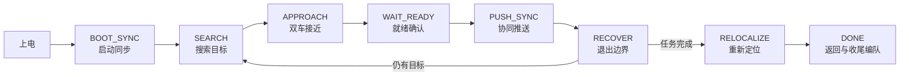

# TU-Smart 2026 蚂蚁搬家双车协同系统

第二十一届全国大学生智能汽车竞赛“蚂蚁搬家”组参赛工程。项目使用两台四轮麦克纳姆车，通过 OpenART 视觉、编码器/IMU 里程计和车间无线通信完成目标搜索、双车会合、协同推送、恢复与最终归位。

> 本文档以仓库当前代码为准。项目中只有一套比赛代码，主车和从车由 `config.py` 中的 `_IS_LEADER` 区分，并由 `build.bat` 分别生成烧录目录。

## 1. 系统概览

两台车采用无中心节点的主从协同方式：

- 主车负责搜索目标、选择推送边、规划接近路线并推进任务阶段。
- 从车根据主车广播的状态和位姿完成编队、绕行至目标另一侧，并与主车同步推送。
- OpenART 提供黄线绝对位姿、物体检测结果以及橙/紫球检测结果。
- 下位机使用编码器和 IMU 连续估计位姿，仅在特定阶段使用视觉结果校正单轴位置或航向。

主流程如下：



状态编号在主、从车中保持一致：

| 状态 | 编号 | 作用 |
| --- | ---: | --- |
| `BOOT_SYNC` | 1 | 建立视觉、无线和初始编队 |
| `SEARCH` | 12 | 主车扫描目标，从车保持搜索编队 |
| `APPROACH` | 13 | 两车分别运动到目标两侧 |
| `WAIT_READY` | 14 | 校验位置与姿态，完成推送前握手 |
| `PUSH_SYNC` | 15 | 同步推送并处理障碍/丢目标 |
| `RECOVER` | 16 | 从边界后退、视觉校准并重新会合 |
| `DONE` | 17 | 返回目标点并完成最终绕行 |
| `RELOCALIZE` | 19 | 沿场地边线重新建立绝对位置 |

## 2. 仓库结构

```text
TU-Smart2026/
├─ README.md
├─ 硬件/
│  └─ 21届智能车+蚂蚁搬家+主驱一体PCB文件.epro
└─ 软件/
   ├─ 工具脚本/
   │  └─ 白平衡标定.py
   └─ 比赛代码/
      ├─ 上位机/
      │  └─ openart.py
      └─ 下位机/
         ├─ base.py
         ├─ config.py
         ├─ debug_switch.py
         ├─ main.py
         ├─ task_leader.py
         ├─ task_follow.py
         ├─ build.bat
         ├─ tools/
         │  └─ mpy-cross-v1.20.0/
         ├─ leader/                 # build.bat 生成/更新
         └─ follower/               # build.bat 生成/更新
```

主要文件职责：

| 文件 | 职责 |
| --- | --- |
| `软件/比赛代码/上位机/openart.py` | OpenART 图像处理、目标跟踪、坐标变换和串口打包 |
| `软件/比赛代码/下位机/base.py` | 电机、编码器、IMU、运动控制、串口协议、调度器和公共工具 |
| `软件/比赛代码/下位机/task_leader.py` | 主车完整任务状态机 |
| `软件/比赛代码/下位机/task_follow.py` | 从车完整任务状态机 |
| `软件/比赛代码/下位机/config.py` | 角色、初始位置、目标数量、场地图样等比赛配置 |
| `软件/比赛代码/下位机/debug_switch.py` | 少量现场调试开关 |
| `软件/比赛代码/下位机/main.py` | 入口，仅导入 `base` 并启动循环 |
| `软件/比赛代码/下位机/build.bat` | 用随仓库提供的 `mpy-cross` 生成主车/从车烧录文件 |
| `软件/工具脚本/白平衡标定.py` | OpenART 白平衡增益标定辅助脚本 |

`leader/` 和 `follower/` 中的 `.mpy` 是构建产物，不是源代码。修改逻辑时应编辑上层 `.py` 文件，然后重新运行 `build.bat`。

## 3. 硬件与运行环境

每台车的主要组成如下：

- 逐飞 Seekfree RT1021 MicroPython 核心板；
- 四轮麦克纳姆底盘，4 路直流电机和编码器；
- IMU660RX，用于连续航向估计；
- OpenART mini，负责场地黄线和目标视觉；
- 一路车间无线串口，用于主从车状态、位姿和目标同步；
- 蜂鸣器与 LCD，用于运行状态提示和现场调试。

串口分配：

| 串口 | 波特率 | 用途 |
| --- | ---: | --- |
| UART2 | 230400 | 双车无线通信 |
| UART3 | 230400 | 下位机与 OpenART 通信 |
| OpenART UART12 | 230400 | 向下位机发送视觉帧、接收控制帧 |

PCB 工程位于 `硬件/21届智能车+蚂蚁搬家+主驱一体PCB文件.epro`。

## 4. 当前比赛配置

`config.py` 当前配置为：

```python
_IS_LEADER = 1

_LEADER_INIT_POS = (40, -40)
_FOLLOWER_INIT_POS = (10, -40)
_DONE_TARGET_POS = ((25, -70), (25, -70))

_OBJ_COUNT_MODE = 3
_OBJ_CLASS_TOTAL = (0, 1, 1, 0, 1, 0)
_OBJ_GROUPS = ((1,), (2, 3), (4, 5))
_OBJ_GROUP_TOTAL = (1, 1, 0)
_OBJ_UNKNOWN_TOTAL = 3

_READY_ROUTE_AVOID_ENABLE = 0
_OBSTACLE_LAYOUT_FILTER_ENABLE = 1
_OBSTACLE_EDGE_LAYOUT = (
    (0, 0, 0),
    (0, 0, 2),
    (0, 0, 0),
    (0, 0, 0),
)
_RED_SANDBAG_BRICK_ZONE_EDGE_DEPTH_CM = 60
_RED_SANDBAG_BRICK_ZONE_ALONG_TOL_CM = 20
_OBSTACLE_CORNER_LAYOUT = (0, 0, 0, 0)

_SEARCH_INITIAL_YAW_MODE = 0
_SEARCH_TIMEOUT_MS = 20000
```

目标类别按视觉模型编号排列：

| 类别 ID | 目标 |
| ---: | --- |
| 0 | 车辆 |
| 1 | 网球 |
| 2 | 蓝色沙包 |
| 3 | 红色沙包 |
| 4 | 白熊 |
| 5 | 棕熊 |
| 6 | 左侧紫球 |
| 7 | 右侧橙球 |
| 8 | 圆锥 |
| 9 | 砖块 |

`_OBJ_COUNT_MODE = 3` 表示只采用 `_OBJ_CLASS_TOTAL` 的逐类别计数：当前要求网球、蓝色沙包、白熊各 1 个。`_OBJ_GROUPS` / `_OBJ_GROUP_TOTAL` 是模式 2 的配置，`_OBJ_UNKNOWN_TOTAL` 是模式 1 的配置；它们在当前模式下不参与完成判定。

`debug_switch.py` 当前开关：

| 开关 | 当前值 | 含义 |
| --- | ---: | --- |
| `READY_HOLD_ENABLE` | 0 | 不在就绪阶段暂停 |
| `BOOT_DIRECT_DONE_ENABLE` | 0 | 不跳过任务直接进入完成流程 |
| `OPENART_BALL_DEBUG_ENABLE` | 1 | 强制 OpenART 在所有状态检测球；会降低视觉帧率 |
| `SEARCH_TUNE_LEADER_RELOCALIZE_HOLD_ENABLE` | 0 | 不冻结主车的最终重定位流程 |

## 5. 下位机架构与实时调度

### 5.1 公共底层

`base.py` 在导入时完成硬件初始化，并根据 `_IS_LEADER` 动态导入 `task_leader` 或 `task_follow`。`main.py` 只负责调用：

```python
import base

base.loop()
```

控制链路为：

```text
任务状态机给出世界坐标速度/航向目标
        ↓
位置与航向控制、速度斜坡
        ↓
世界坐标速度转换为车体速度
        ↓
麦克纳姆轮运动学解算
        ↓
四路电机速度 PID
        ↓
PWM / DIR 输出
```

任务要求立即停车时会调用硬停止逻辑，同时清零世界/车体速度目标并复位速度 PID，避免旧积分量在下一阶段重新推动电机。

### 5.2 定时任务

底层使用三个硬件定时器分担实时工作：

| 周期 | 主要工作 |
| ---: | --- |
| 1 ms | 高频计数与基础时基 |
| 2 ms | 电机速度环 |
| 3 ms | OpenART 串口接收；每 3 次处理一次解析，约 9 ms |
| 5 ms | 角速度环、运动状态更新、世界/车体速度换算 |
| 10 ms | 航向角环、IMU/编码器里程计、视觉控制帧调度、无线轮询 |
| 20 ms | 位置控制 |

主循环负责蜂鸣器、通信有效期、任务状态机、LCD 和垃圾回收等非硬实时工作。相机接收缓冲区上限为 400 字节，无线接收缓冲区上限为 200 字节。

### 5.3 位姿来源与视觉校正

车辆位姿由三类信息共同维护：

| 来源 | 用途 | 特性 |
| --- | --- | --- |
| 四轮编码器 | 连续 X/Y 里程计 | 高频、平滑，但会累积误差 |
| IMU | 连续 yaw | 高频、平滑，但存在零漂 |
| OpenART 黄线 | 绝对 X、Y 或 yaw | 无长期漂移，但低频且可能误检 |

视觉校正不是每帧无条件覆盖：

- X/Y 校正由状态机按轴启用，并结合场地边缘门限过滤错误黄线。
- yaw 自动视觉校正默认关闭。主车在 `RECOVER` 中自行检查 `_YawAngle_fix`，要求误差在允许范围内并稳定后，再调用 `correct_yaw()` 一次性校正航向基准。
- 推送阶段会使用视觉位置确认是否真正越过边界，而不是只依赖里程计。

## 6. OpenART 视觉

### 6.1 相机和模型

`openart.py` 的当前主要参数：

| 项目 | 当前值 |
| --- | --- |
| 图像尺寸 | QVGA，320 × 240 |
| 神经网络输入 | 96 × 96 |
| 模型 | `/sd/yolo3_iou_smartcar_final_with_post_processing.tflite` |
| 固定白平衡增益 | `(99, 64, 83)` |
| 增益 | 2.2 |
| 曝光 | 520 |
| Hough 球检测 | 关闭，`BALL_USE_HOUGH = False` |

模型优先加载到 Frame Buffer，失败时退回普通加载；模型仍无法加载时，黄线与球检测可以继续运行。

OpenART 支持两套相机标定：`CAR_ID = 1` 对应主车，`CAR_ID = 2` 对应从车。更换车辆或相机后必须确认该值及对应单应性参数。

### 6.2 每帧处理顺序

视觉主循环依次执行：

1. 拍摄并校正图像；
2. 检测黄线，计算可用的绝对 X/Y/yaw；
3. 先发送一次视觉帧，使下位机尽快获得本帧位姿；
4. 根据下位机控制位决定是否执行 YOLO；
5. 对检测框做地面坐标转换、筛选、跟踪和目标选择；
6. 再发送一次视觉帧，携带本帧目标列表；
7. 按状态决定是否检测橙球/紫球并发送球帧。

因此，一次图像循环通常发送两帧类型 7 数据：第一帧的位姿是新的、物体列表可能来自上一轮；第二帧包含本轮更新后的物体列表。下位机通过时间戳和有效标志判断数据新鲜度。

### 6.3 目标选择与筛选

- 类型 7 帧固定预留 7 个槽位：2 个普通货物槽，以及车辆、左球、右球、圆锥、砖块各 1 个专用槽；因此当前每帧最多上报 2 个普通货物目标。
- 自由目标选择距离上限为 60 cm。
- 候选目标需连续出现 2 个推理帧，且类别一致、位置距离不超过 30 cm。
- 从车使用目标坐标时另有 40 cm 的位置门控。
- 红色沙包靠近图像边缘时使用 6 像素边缘过滤。
- OpenART 还启用了红色沙包世界 X 坐标过滤；通常过滤 `X < 70` 的结果，但特定当前选择编号可放行。
- 橙球和紫球使用颜色阈值与 Alpha-Beta 跟踪，主要服务于接近/等待阶段；推送阶段使用普通物体视觉，不使用球跟踪控制层。

### 6.4 白平衡标定

`软件/工具脚本/白平衡标定.py` 会在中心 60 × 60 区域执行约 3 秒自动白平衡，并打印可写回 `openart.py` 的 RGB 增益。脚本标定曝光为 2500，结束后的预览曝光为 8000；这与比赛主程序的曝光值不同，使用时不要直接混用。

## 7. 双车协同与状态机

### 7.1 启动 `BOOT_SYNC`

- 两车初始航向为 90°。
- 主车初始位置 `(40, -40)`，从车初始位置 `(10, -40)`。
- 主、从车横移距离均为 60 cm，速度 80；纵向启动移动为 20 cm。
- 主车等待从车进入 `SEARCH` 且无线状态新鲜后开始搜索，不再等待从车额外上报“搜索 ready”。

### 7.2 搜索 `SEARCH`

主车搜索流程：

1. 从当前位置沿固定向量驶向 `(120, 55)`，速度 80，并保持 90° 航向；任一运动轴到达目标即结束该段。
2. 稳定 100 ms 后进入扫描。
3. 每次横扫前本地硬停 500 ms，不等待从车 ready。
4. 在搜索矩形内以速度 70 做蛇形横扫；到达横向边界后沿车头方向前进最多 30 cm，再反向横扫。首次进入横扫时开始计算 20 s 总超时。
5. 首段移动、扫描、步进和扫描前暂停期间均允许锁定目标。
6. 搜索过程中允许执行一次黄线位置修正；暂停与修正耗时会补回搜索计时。

横扫时只考虑车前相对 X/Y 均在 0～50 cm 范围内的障碍。障碍会让车辆提前切入换行前进；换行阶段叠加的退避速度为 `3 × (60 - 障碍距离)`，上限为 98。退避方向优先远离障碍，并受搜索区域 10 cm 内边距约束。完成一次已知边搜索后，会忽略相同旧边并期待对边或未知边，避免重复命中。

从车在 `SEARCH` 中依次执行环绕编队、后方航向对齐和平移编队，并动态修正与主车的相对位置。视觉与无线位置同时可用时做融合；只剩无线时退化跟随；两者都不可用时原地旋转搜寻。`ready = 2` 仅用于报告编队状态，不再阻塞主车每次扫描。

### 7.3 接近 `APPROACH`

主车根据目标位置、类别、场地边界和障碍布局选择推送边，并决定两车站位：

- 主车从目标一侧接近，从车绕行到另一侧，形成 V 形夹持阵型。
- 普通货物的主车贴近距离约 13 cm，从车约 9 cm。
- 网球使用更保守的距离：主车约 16 cm，从车约 13 cm。
- 目标锁定距离为 30 cm。
- 圆锥/砖块的对角避障使用 40° 偏角与 60 cm 间隙；普通货物的路线对角修正使用 15° 偏角与 20 cm 横移。

从车绕行数据的新鲜度门限为 700 ms。若视觉目标失效，状态机会依据无线目标、最近有效观测和超时规则回退或重新搜索。

### 7.4 等待 `WAIT_READY`

两车在推送前再次校验位置与航向：

- `ready = 1` 表示本车就绪或启动阶段相机已就绪。
- 主车确认双方条件后发送 `ready = 3`，准备切入推送。
- 当前 `_READY_ROUTE_AVOID_ENABLE = 0`，等待阶段的路线避障功能默认关闭。

### 7.5 推送 `PUSH_SYNC`

- 主、从车基础推送速度均为 120。
- 两车都使用普通物体视觉进行闭环修正；从车的球类推送控制层已移除。
- 从车在目标橙球侧时，主车先启动，100 ms 后发送 `ready = 4`；从车在紫球侧时，主车先发送 `ready = 4`，自身等待 100 ms 后启动。
- 从车收到 `ready >= 4` 后开始推送；为避免无线握手永久卡死，最迟 1500 ms 后也会进入推送。

丢目标处理：

- 普通目标视觉丢失 800 ms 后进入旋转搜索，最长约 3200 ms。
- 从车是否进入丢目标恢复主要跟随主车状态，不单独根据本车视觉擅自切换。
- 双方重新发现目标后使用 `ready = 5` 协调，再回到接近流程。
- 网球正常推送时即使视觉短暂丢失，也继续沿固定参考方向推送，不进入上述旋转搜索。

障碍对角修正：

- 圆锥/砖块要求两次不同时间的观测，侧向走廊为车辆两侧约 40 cm，按 `60 - 间隙` 计算修正距离，偏角 40°，最长 3000 ms。
- 其他货物的路线障碍走廊约为 ±16 cm，固定修正 20 cm，偏角 15°，最长 1600 ms。
- 若两侧同时有障碍，不执行单侧对角修正。
- 主车先向从车下发修正方向，再延迟约 100 ms 自身动作；退出修正时同样进行同步。

主车以新鲜视觉位置的连续确认和越界余量 6 cm 判断推送完成。从车主要依据主车的完成标志或主车切入 `RECOVER`、`RELOCALIZE`、`DONE` 来结束推送。

### 7.6 恢复 `RECOVER`

主车流程：

1. 以速度 80 后退 8 cm，最长 2000 ms。
2. 朝刚推送的边线倒车并采集视觉位置，边线距离阈值 50 cm；连续 2 次有效或 2000 ms 超时后继续。
3. 使用视觉航向完成一次 yaw 校正：误差容限 2°、有效范围 ±25°、最大转速 50°/s、稳定保持 100 ms，总超时 1000 ms。
4. 若仍有目标，转向与上一次推送方向相反的搜索航向，角度误差 6° 内完成，最长 1500 ms。
5. 等待从车报告恢复/搜索/重定位编队完成；这里没有固定超时。

从车同样先后退 8 cm，再寻找主车。普通情况下以速度 80 平移到编队位置，视觉中心容差约 ±10 cm；发生过对角避障时，会先绕到主车与障碍相反的一侧再恢复编队。完成后发送 `ready = 2`。

### 7.7 重定位 `RELOCALIZE`

主车等待从车进入重定位编队后执行：

1. 转到 270°；
2. 预移动到约 `(50, 50)`，速度 120；
3. 沿 X 边线行驶，速度 80，接近有效视觉区域后降为 60；视觉误差小于 40 cm 连续 2 次即可确认，最长 7000 ms；若该段超时则跳过 Y 段并直接进入 `DONE`；
4. 转到 180°并沿 Y 边线行驶，使用相同基础/低速；连续 3 次确认，最长 20000 ms；
5. 进入 `DONE`。

各段之间不额外停车。重定位障碍使用 3 s 记忆窗口；最近障碍小于 50 cm 时，执行固定 140 的 `-Y` 方向退避。

从车先通过视觉主车位置与无线位姿保持约 30 cm 距离。视觉和无线都丢失超过 1500 ms 后，开始自身重定位；预置位置约为 `(80, 80)`，随后执行与主车相同的 X/Y 边线校准。当主车进入 `DONE` 时，从车按当前航向选择 +X 20 cm 或 +Y 40 cm 的脱离动作，最长 1500 ms。

### 7.8 完成 `DONE`

- 当前两车目标点均为 `(25, -70)`，位置速度 200。
- 位置误差进入 2 cm 并稳定 300 ms 后，进入收尾编队。
- 未发现另一台车时以 180°/s 旋转搜索。
- 编队目标距离约 26 cm，稳定 200 ms 后发送 `ready = 6`。
- 最终绕行速度 40，累计角度达到 390° 后发送 `ready = 7` 并完成。

## 8. 通信协议

OpenART 和无线协议均使用固定帧头 `0xAA 0x55`。常规有符号 16 位数以 0.1 为精度、按大端序编码；无线坐标中的成对 12 位数使用单独的紧凑格式。末字节为 CRC-8，初值 `0x00`，生成多项式为 `0x31`，校验范围从类型字节开始且不含 CRC 本身。下位机无线请求应答延迟为 5 ms，应答超时为 60 ms；无线控制命令有效期为 1000 ms。

### 8.1 OpenART 控制帧：类型 8，17 字节

下位机约每 10 ms 向 OpenART 发送一次，用于同步车辆状态、控制视觉模块及指定当前目标。主要内容包括：

- 车辆状态和子状态；
- 黄线、模型和球检测开关；
- 目标选择 ID；
- 推送方向、角色及其他控制标志。

OpenART 中可解析一个边缘模式标志，但当前下位机发送端未设置该位，实际值保持为 0。

### 8.2 OpenART 视觉帧：类型 7，40 字节

当前下位机解析器只接受类型 7、长度 40 的视觉帧，不兼容旧的类型 2/4 动态长度格式。

视觉帧包含：

- 黄线计算出的 X、Y、yaw 及其有效标志；
- 7 个固定目标槽，每槽 4 字节，依次为相对 X、相对 Y、类别和跟踪 ID；槽 0/1 用于普通货物，槽 2～6 分别用于车辆、左球、右球、圆锥和砖块；
- 当前视觉模式和校验信息。

没有目标的槽位使用无效值填充，因此帧长度固定，适合在 MicroPython 中用预分配缓冲区解析。

球检测结果不使用独立帧，而是放在类型 7 的左球/右球专用槽中。下位机按车辆状态决定是否采用这些数据；球数据主要参与 `APPROACH` 和 `WAIT_READY`，不作为从车 `PUSH_SYNC` 的控制层。

### 8.3 双车无线状态帧：类型 6，37 字节

无线状态帧传递以下信息：

- 帧序号、本车航向和世界坐标位置；
- 本车主状态、子状态和协同 `ready` 值；
- 当前目标类别、推送边和目标世界坐标；
- 当前圆锥、砖块观测及其有效标志；
- 命令序号/子命令、接近与路线命令、从车航向方向命令；
- 世界速度目标、侧向推送命令和其他状态标志。

航向和大多数动作量按 `数值 × 10` 打包为 16 位整数；本车、目标和障碍坐标则以 0.5 cm 精度压缩为成对的 12 位有符号数。状态标志的 bit 4～5 当前只使用值 0 或 3，表示是否保持恢复阶段的侧向编队；旧的“左侧/右侧”枚举已不再使用。

`ready` 的当前语义：

| 值 | 含义 |
| ---: | --- |
| 0 | 无协同事件 |
| 1 | 启动相机就绪，或本车在等待阶段位置有效 |
| 2 | 搜索/重定位编队完成；从车恢复阶段找到主车并居中 |
| 3 | `WAIT_READY` 已确认，可切入推送 |
| 4 | 推送 GO |
| 5 | 推送丢目标后重新发现目标 |
| 6 | 最终编队完成 |
| 7 | 最终绕行完成 |

## 9. 构建与烧录

### 9.1 生成主车和从车文件

在 Windows 命令提示符或 PowerShell 中进入下位机目录：

```powershell
cd .\软件\比赛代码\下位机
.\build.bat
```

脚本使用仓库自带的 `mpy-cross-v1.20.0`，执行顺序为：

1. 临时修改 `config.py` 的 `_IS_LEADER`；
2. 编译公共模块、调试开关和对应任务状态机；
3. 分别写入 `follower/` 与 `leader/`；
4. 恢复源配置文件。

构建成功后，两套目录都包含可直接复制到对应核心板文件系统的入口和 `.mpy` 文件。不要手工编辑生成的 `.mpy`。

### 9.2 烧录检查

主车：

- 使用 `leader/` 中的文件；
- OpenART 的 `CAR_ID` 设置为 1；
- 确认相机 SD 卡模型路径与代码一致。

从车：

- 使用 `follower/` 中的文件；
- OpenART 的 `CAR_ID` 设置为 2；
- 确认使用从车对应的相机标定参数。

OpenART 脚本不由 `build.bat` 处理，需要单独复制到相机并保存为启动脚本。两台 OpenART 可共用同一份源码，但 `CAR_ID` 必须按车辆分别设置。

## 10. 调试与常见问题

### LCD 信息

底层默认开启调试 LCD。页面会显示本车状态/子状态、无线对端状态、位姿、航向、视觉有效性、目标信息、准备值及部分障碍/推送诊断数据。现场首先确认状态是否持续更新，再判断是控制问题还是通信问题。

### 搜索阶段不开始扫描

依次检查：

1. 从车无线状态是否新鲜并已进入 `SEARCH`；
2. 主车是否完成到 `(120, 55)` 的首段移动；
3. 是否仍处于 100 ms 稳定或 500 ms 扫描前硬停；
4. 是否已经在首段移动中提前锁定目标。

当前代码不要求从车在每次扫描前发送 ready，排查时不要按旧握手逻辑等待。

### 视觉有图但下位机没有目标

检查：

- 串口是否为 230400，接线方向是否正确；
- 模型文件路径和 SD 卡是否正确；
- OpenART 是否收到下位机类型 8 控制帧，模型开关是否开启；
- 下位机收到的是否为类型 7、固定 40 字节的数据；
- 目标是否被距离、连续帧、类别、红色沙包边缘或世界坐标门限过滤；
- `CAR_ID` 和单应性标定是否与车辆匹配。

### 两车状态不同步

先检查无线帧的新鲜度、对端状态和 `ready` 值。控制命令超过 1000 ms 会失效，不能把旧包当作仍有效的动作指令。推送阶段还要区分 `ready = 3`（允许进入推送）和 `ready = 4`（实际 GO）。

### 位姿突然跳变

检查当前状态是否启用了对应轴的视觉校正、黄线结果是否位于预期边界附近，以及 OpenART 的 `CAR_ID`/标定参数是否正确。yaw 自动校正默认关闭；`RECOVER` 中的航向校正是经过有效范围和稳定时间检查后的一次性操作。

## 11. 修改约定

- 比赛参数优先放入 `config.py`；临时行为开关放入 `debug_switch.py`。
- 公共硬件、控制和协议修改放在 `base.py`，不要在两份任务文件中复制底层实现。
- 主、从任务逻辑分别修改 `task_leader.py` 和 `task_follow.py`，同时核对状态编号、子状态、超时和 `ready` 语义。
- 修改视觉协议时必须同步检查 `openart.py` 的打包和 `base.py` 的解析，固定长度、字段偏移和 CRC 必须完全一致。
- 修改车辆或相机后重新标定白平衡与单应性参数。
- 提交前重新运行 `build.bat`，但不要把 `.mpy` 当作可审查源码。

## 12. 说明

本工程包含强现场属性的参数，包括相机曝光、颜色阈值、底盘里程系数、场地坐标、目标数量和障碍布局。迁移到另一套硬件或场地时，应先完成单车运动、黄线定位和串口协议验证，再联调双车状态机。
